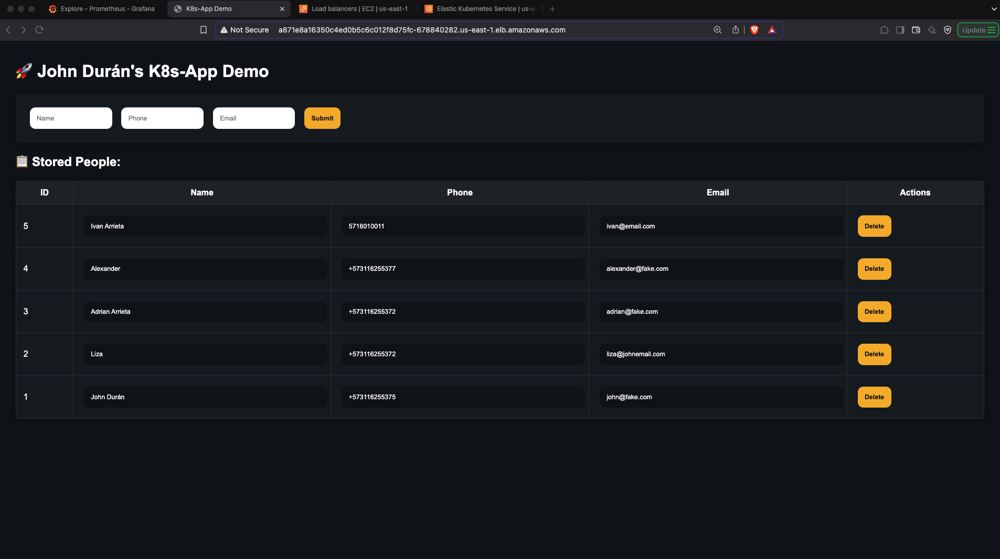

# AWS Elastic Kubernetes Service Project

This project leverages the stack set up on minikube in the project https://github.com/johalduran7/prometheus-grafana-k8s

This is intended to show how to deploy the same stack on EKS and the provisioning via Terraform.

**Prerequisites:**

  - If you have a cluster running locally, like on minikube, you have to check what resources you need on EKS
    ```bash
    $ docker stats
    CONTAINER ID   NAME       CPU %     MEM USAGE / LIMIT   MEM %     NET I/O         BLOCK I/O        PIDS
    b30eae46b085   minikube   130.15%   1.9GiB / 2.148GiB   88.42%    643kB / 537kB   3.01GB / 551MB   995
    ```
    - check the current memory limit, and use the thumb rule,if the limit is 2.4 GB, you use ~3-4GB.

  - check the size of the volumes:
      ```bash
      $ minikube ssh -- docker system df
      TYPE            TOTAL     ACTIVE    SIZE      RECLAIMABLE
      Images          50        26        7.881GB   4.5GB (57%)
      Containers      92        46        72.86kB   34.52kB (47%)
      Local Volumes   2         2         355.3kB   0B (0%)
      Build Cache     0         0         0B        0B
      ```
    - OS + Kubernetes Overhead	6 GB
    - Your Images + Volumes + Containers	~8 GB
    - Safety Buffer	2 GB
    - Recommended EBS Volume	16 GB
  - so, the right fit is t3.medium https://aws.amazon.com/ec2/instance-types/
  - The EBS, 16GB, however, the type of instance accepts 20GB as minimum.

  - The cost is gonna be like: $0.0434 USD per hour

  - Now, the calculation before is just for the worker node, whereas for the control plane node (master) is 0.1 USD in most of the regions. So the total of the EKS cluster per hour is ~$0.1434 per hour.


### Deployments

This project deploys the following components:

-   **Node.js App:** A web application that allows users to upload and retrieve images, utilizing a PostgreSQL database for storage. NOTE: The scope of the project doesn't comprise development skills about the application itself. This is intended to show the configuration of Grafana and Prometheus as well as the configuration to scrape metrics. 
-   **PostgreSQL:** A robust relational database management system used to persist image data.
-   **Prometheus:** A powerful monitoring and alerting toolkit that collects metrics from the deployed applications and infrastructure.
-   **Grafana:** A data visualization and monitoring tool that provides dashboards to visualize metrics collected by Prometheus.
<table>
  <tr>
    <td></td>
    <td></td>
    <td></td>
    <td></td>
  </tr>
</table>

### How to Run

1.  **EKS Setup:**
  - Deploying EKS using terraform.
    - reference: https://docs.aws.amazon.com/eks/latest/userguide/getting-started-console.html
    - Explanation of the resources deployed:
      - cluster iam role: aws_iam_role.eks_cluster_role
        - policies attached: 
          - arn:aws:iam::aws:policy/AmazonEKSClusterPolicy
      - node iam role: aws_iam_role.eks_node_role
        - policies attached: 
          - arn:aws:iam::aws:policy/AmazonEKSWorkerNodePolicy
          - arn:aws:iam::aws:policy/AmazonEC2ContainerRegistryReadOnly
          - arn:aws:iam::aws:policy/AmazonEKS_CNI_Policy
      - Networking:
        - default VPC used, for simplicity
        - NOTE: there should be at least 2 AZs to guarantee fault tolerance.
      - aws_eks_clustr.eks
      - aws_eks_node_group.eks_nodes
      
    - NOTE: it takes up to 15m
    - the eks_node_role should allow the node to assum the roles:
      - "ec2.amazonaws.com","eks.amazonaws.com"
    - go to the repository ./terraform_eks and apply the changes:
        ```bash
        terraform apply -auto-approve
        ```
    - Granting IAM user permissions to see EKS resources
      - Your IAM user won't have access to EKS resources even if it's the admin. This is because we have to add the user to the configmap aws-auth in the kube-system namespace.
      - current config of the auth-file
        ```bash
        $ kubectl get configmap aws-auth -n kube-system -o yaml
        apiVersion: v1
        data:
          mapRoles: |
            - groups:
              - system:bootstrappers
              - system:nodes
              rolearn: arn:aws:iam::ACCOUNT_ID:role/eks-node-role
              username: system:node:{{EC2PrivateDNSName}}
        kind: ConfigMap
        metadata:
          creationTimestamp: "2025-03-09T13:06:05Z"
          name: aws-auth
          namespace: kube-system
          resourceVersion: "831"
          uid: f5476462-b4dd-4ec5-95af-f7419d2d5525
        ```
      
      - Adding my AWS user to mapUsers:
        - 
          $ kubectl edit configmap aws-auth -n kube-system

      - built-in Kubernetes RBAC (Role-Based Access Control)


2.  **Prepare the Node.js Application Image:**

    Before deploying the Node.js application, ensure it is properly initialized:

    1.  Navigate to the `app` directory:

        ```bash
        cd app
        ```

    2.  Initialize a Node.js project:

        ```bash
        npm init -y
        ```

    3.  Install the required dependencies:

        ```bash
        npm install express ejs multer pg
        ```

    4.  Apply Terraform to push the Docker image to ECR:

        ```bash
        cd ./terraform && terraform init && terraform apply -auto-approve
        ```

        Obtain the repository name from the Terraform output and update the `repository` value in `./app/k8s/values.override.yaml`. Note that `values.yaml` is a placeholder and should not be modified.

3.  **Create the Kubernetes Namespace:**

    Create a dedicated namespace for the project:

    ```bash
    kubectl apply -f ./k8s-namespace/namespace.yaml
    # or
    kubectl create namespace prometheus-grafana-k8s
    ```

    You can also set the current namespace for `kubectl` commands:

    ```bash
    kubectl config set-context --current --namespace=prometheus-grafana-k8s
    ```

4.  **Deploy PostgreSQL:**

    Deploy the PostgreSQL database using Helm:

    ```bash
    helm install k8s-postgres ./postgres/k8s -f ./postgres/k8s/values.override.yaml -n prometheus-grafana-k8s
    ```

    **Note:** If desired, you can set the current namespace as the default for `kubectl` using the command provided above.

5.  **Authenticate with ECR:**

    If your Node.js application image is hosted on ECR, authenticate with the registry. This example uses the AWS CLI for simplicity:

    ```bash
    aws ecr get-login-password --region us-east-1 | \
    kubectl create secret docker-registry ecr-registry-credentials \
    --docker-server=<AWS_ACCOUNT_ID>.dkr.ecr.us-east-1.amazonaws.com \
    --docker-username=AWS --docker-password=$(aws ecr get-login-password --region us-east-1) \
    -n prometheus-grafana-k8s
    ```

    **Note:** ECR login credentials expire after 12 hours and need to be refreshed.

6.  **Deploy the Node.js Application:**

    Deploy the Node.js application using Helm:

    ```bash
    helm install k8s-app ./app/k8s -f ./app/k8s/values.override.yaml -n prometheus-grafana-k8s
    ```

    The application will automatically create the necessary database tables if they do not exist.

    Verify that the PostgreSQL and Node.js application pods are running:

    ```bash
    helm list
    kubectl get pod
    ```

    Example output:

    ```
    john@john-VirtualBox:~/prometheus-grafana-k8s$ helm list
    NAME        	NAMESPACE             	REVISION	UPDATED                                	STATUS  	CHART         	APP VERSION
    k8s-app     	prometheus-grafana-k8s	5       	2025-03-01 20:25:44.424525028 -0500 -05	deployed	k8s-app-0.1.0 	1.0.0
    k8s-postgres	prometheus-grafana-k8s	1       	2025-03-01 19:21:49.420486707 -0500 -05	deployed	postgres-0.1.0	15.0
    john@john-VirtualBox:~/prometheus-grafana-k8s$ kubectl get pod
    NAME                       READY   STATUS    RESTARTS   AGE
    k8s-app-547dbf6dcc-2n7bk   1/1     Running   0          13m
    postgres-7c9886f7d-tr8bx   1/1     Running   0          77m
    john@john-VirtualBox:~/prometheus-grafana-k8s$
    ```

7.  **Update the Node.js Application:**

    Just in case you have to update the app. You can skip this step. When you make changes to the Node.js application code (`app.js`), rebuild the Docker image and apply the changes using Terraform. Then, restart the deployment:

    ```bash
    kubectl rollout restart deployment k8s-app -n prometheus-grafana-k8s
    ```

    The changes will be reflected in the application.

    Example:

    ```
    john@john-VirtualBox:~/prometheus-grafana-k8s$ kubectl rollout restart deployment k8s-app -n prometheus-grafana-k8s
    deployment.apps/k8s-app restarted
    john@john-VirtualBox:~/prometheus-grafana-k8s$ kubectl get pod
    NAME                       READY   STATUS              RESTARTS   AGE
    k8s-app-547dbf6dcc-2n7bk   1/1     Running             0          60m
    k8s-app-68456754bb-mvb9g   0/1     ContainerCreating   0          3s
    postgres-7c9886f7d-tr8bx   1/1     Running             0          124m
    john@john-VirtualBox:~/prometheus-grafana-k8s$
    ```

    The IP mapping won't change; just refresh the page in your web browser.

    At this point, you can view the application, open pgAdmin, and run queries against the database.


8. **Install Prometheus and Grafana:**

    - Install the Storage for GP3:

      ```bash
      kubectl apply -f ./prometheus-grafana-stack/storage-class.yaml -n prometheus-grafana-k8s
      ```    

    - Install the `kube-prometheus-stack` Helm chart:

      ```bash
      helm install k8s-kube-prom-stack prometheus-community/kube-prometheus-stack \
        --namespace prometheus-grafana-k8s \
        -f ./prometheus-grafana-stack/values-kube-stack.yaml
      ```

    The release name `k8s-kube-prom-stack` will be used in the ServiceMonitor for Prometheus to scrape metrics.

9. **Configure Metrics Exporters:**

    Configure metrics exporters for PostgreSQL and the Node.js application. There are several ways to export metrics:

    1.  Export metrics in the application using a Prometheus client library.
    2.  Add Prometheus annotations to the Kubernetes deployment.
    3.  Use a sidecar container to export metrics.
    4.  Use a dedicated metrics exporter.
    5.  Use ServiceMonitors/PodMonitors.
    6.  Manually configure scrape jobs.
    7.  Use Pushgateway.

    I'll use Exporters

    **Install PostgreSQL Exporter:**

    ```bash
    helm install k8s-postgres-exporter prometheus-community/prometheus-postgres-exporter -f ./exporters/postgres-exporter-values.override.yaml -n prometheus-grafana-k8s
    ```

    Access the exporter's web page by forwarding the port:

    ```bash
    kubectl get svc | grep -i exporter
    kubectl port-forward svc/k8s-postgres-exporter-prometheus-postgres-exporter 9187:80
    ```

    Check if the exporter has detected PostgreSQL by visiting `http://localhost:9187/metrics`. Look for `pg_up 1`.

    you should see something along these lines: 
    ```bash
    # HELP pg_up Whether the last scrape of metrics from PostgreSQL was able to connect to the server (1 for yes, 0 for no).
    # TYPE pg_up gauge
    pg_up 1
    ```

    Deploy a ServiceMonitor for the PostgreSQL exporter:

    ```yaml
    serviceMonitor:
      enabled: true
      labels:
        release: prometheus
    ```

    Verify the ServiceMonitor deployment:

    ```bash
    kubectl get servicemonitor
    ```
    Now, you add a nice dashboard from https://grafana.com/grafana/dashboards/455-postgres-overview/


    **Add ServiceMonitor for Node.js App:**
    The metrics exported by the application really depends on you. I added metrics to count the total of requests and the count of type of requests to DB. This may be meaningless but it's out of the scope of this project.

    Create `exporters/k8s-app-exporter-values.yaml`:

    ```yaml
    apiVersion: monitoring.coreos.com/v1
    kind: ServiceMonitor
    metadata:
      name: k8s-app-monitor
      namespace: prometheus-grafana-k8s
      labels:
        release: k8s-kube-prom-stack
    spec:
      selector:
        matchLabels:
          app: k8s-app
      endpoints:
        - port: metrics
          path: "/metrics"
          interval: 30s
    ```

    Apply the ServiceMonitor:

    ```bash
    kubectl apply -f ./exporters/k8s-app-exporter-values.yaml
    ```
    You can leverage Loki to visualize the metrics or logs from the app

    
    
## 10. Access Resources

There are four ways to access resources in the EKS cluster:

### 1. Port Forward to Access Locally
Just like on Minikube, you can use port forwarding:
```bash
kubectl port-forward svc/<app-service> <external-port>:<servicePort> -n <namespace>
kubectl port-forward svc/pgadmin-service 9091:80 -n prometheus-grafana-k8s
```
Access the service on `localhost:9091`.

### 2. Exposing with a LoadBalancer Service (Public Access)
**IMPORTANT NOTE:** For every service of type `LoadBalancer`, a classic load balancer will be created on AWS. For testing purposes, exposing only one service is recommended. The application itself was chosen.

This load balancer is **not** managed by Terraform and must be deleted manually.

- Configure a service with `type: LoadBalancer`.
- Apply the configuration (this service is already running as it was installed by Helm):
  ```bash
  kubectl apply -f ./app/k8s/templates/app-service-lb.yaml
  ```
- Check the external endpoint:
  ```bash
  kubectl get service -n prometheus-grafana-k8s
  ```
  Example output:
  ```bash
  NAME               TYPE           CLUSTER-IP      EXTERNAL-IP                                                               PORT(S)        AGE
  k8s-app            NodePort       10.100.39.10    <none>                                                                    80:32420/TCP   50m
  k8s-app-lb         LoadBalancer   10.100.48.133   adbef8db6d3ea4370914e2c22989771a-1791137444.us-east-1.elb.amazonaws.com   80:31949/TCP   3m42s
  ```
- Access the service at:
  ```
  http://adbef8db6d3ea4370914e2c22989771a-1791137444.us-east-1.elb.amazonaws.com:80
  ```

### 3. Exposing with an Ingress Controller

- **Create an IAM Role for the ServiceAccount** (different from the cluster IAM role):
  ```bash
  eksctl create iamserviceaccount \
    --cluster eks-cluster \
    --namespace kube-system \
    --name aws-load-balancer-controller \
    --attach-policy-arn arn:aws:iam::ACCOUNT_ID:policy/AWSLoadBalancerControllerIAMPolicy \
    --approve
  ```
  **Note:** The `AWSLoadBalancerControllerIAMPolicy` was already created via Terraform.

- This command will create a CloudFormation stack and an IAM role:
  ```bash
  eksctl-eks-cluster-addon-iamserviceaccount-ku-Role1-qrjksIYLp300
  ```

- **Install AWS Load Balancer Controller (instead of Nginx)**:
  ```bash
  helm repo add eks https://aws.github.io/eks-charts
  helm repo update

  helm install aws-load-balancer-controller eks/aws-load-balancer-controller \
    -n kube-system \
    --set clusterName=eks-cluster \
    --set serviceAccount.create=false \
    --set serviceAccount.name=aws-load-balancer-controller \
    --set region=us-east-1
  ```

- Ensure **IMDSv2** is set to optional.
- To refresh the controller deployment:
  ```bash
  kubectl rollout restart deployment aws-load-balancer-controller -n kube-system
  ```

- **Tag subnets for ALB discovery**:
  ```bash
  aws ec2 create-tags --resources subnet-f5c09ab8 subnet-9631a6c9 \
    --tags Key=kubernetes.io/role/elb,Value=1
  ```

- **Troubleshoot issues** by checking logs:
  ```bash
  kubectl logs -n kube-system -l app.kubernetes.io/name=aws-load-balancer-controller | grep -i error
  ```

- **Deploy the ingress resource**:
  ```bash
  kubectl apply -f ./ingress/templates/k8s-grafana-ingress.yaml -n prometheus-grafana-k8s
  ```

- **Check the ingress address**:
  ```bash
  kubectl get ingress
  ```
  Example output:
  ```bash
  NAME                  CLASS   HOSTS   ADDRESS                                                                   PORTS   AGE
  k8s-grafana-ingress   alb     *       k8s-grafanaingressgro-12ecc227c1-2111689879.us-east-1.elb.amazonaws.com   80      2m1s
  ```
- Access the service at:
  ```
  http://k8s-grafanaingressgro-12ecc227c1-2111689879.us-east-1.elb.amazonaws.com
  ```

### 4. Using AWS SSM Port Forwarding

**Note:** The SSM Agent must be installed on the EC2 instance.

- Start a session and port forward:
  ```bash
  aws ssm start-session --target i-xxxxxxxxxxxxxxxxx
  kubectl port-forward svc/pgadmin-service 8080:80 -n your-namespace
  ```


10. **Clean up:**
  ```bash
  Delete the stack created on cloudformation
  Delete the load balancers
  Delete the target groups
  Delete security groups created by K8S and not tracked by Terraform
  Delete the volumes
  This process takes a lot of time so you can manually delete some resources to speed it up
  Destroy infrastructure:
  $ terraform destroy -auto-approve
  ```


